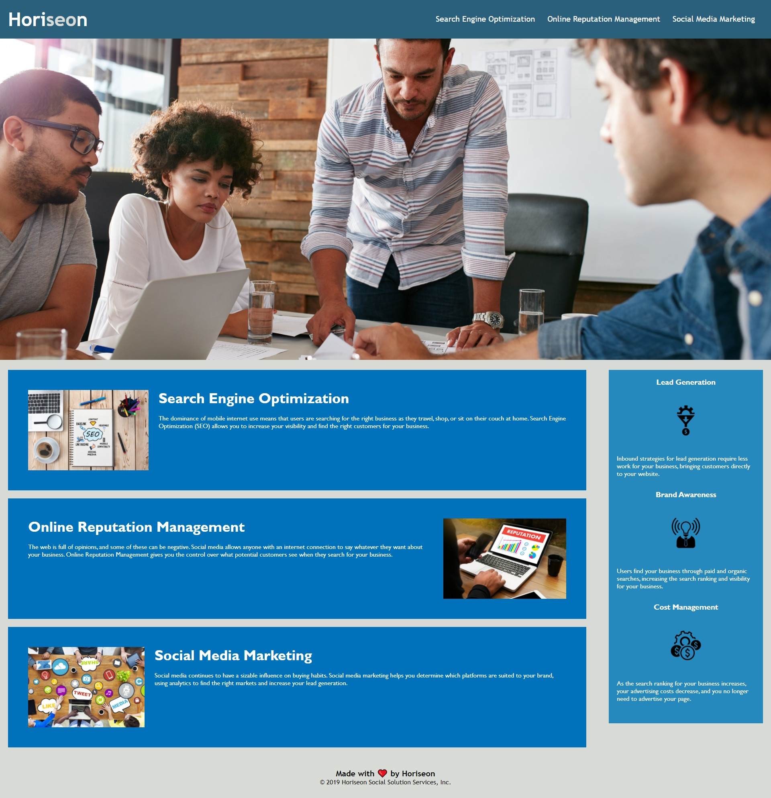

# Code Refactor for Horiseon Homepage

## Description

The marketing agencey Horiseon needed a code refactor for their homepage. The main objective is to update the codebase that follows accessibility standards. Additionally the stylesheet for the webpage needed to be cleaned up.

## Updates

The updates done to the index.html and style.css documents are listed below
* Updated div tags to appropriate semantic tags
* Included alt text in all images
* Included titles for all links
* Consolidated repeated css fromatting
* Confirmed the elements follow a logical and sequential order
* Confirmed heading attributes are in sequential order
* Updated the title to a more descriptive title
* Organized and Commented on style.css

## Initial Mock-up
The following image is the mock-up provided for the code refactor:

## Final Product
The following image is the final version after code refactoring:

## License
MIT License

Copyright (c) 2020 Amanda LeMoine

Permission is hereby granted, free of charge, to any person obtaining a copy
of this software and associated documentation files (the "Software"), to deal
in the Software without restriction, including without limitation the rights
to use, copy, modify, merge, publish, distribute, sublicense, and/or sell
copies of the Software, and to permit persons to whom the Software is
furnished to do so, subject to the following conditions:

The above copyright notice and this permission notice shall be included in all
copies or substantial portions of the Software.

THE SOFTWARE IS PROVIDED "AS IS", WITHOUT WARRANTY OF ANY KIND, EXPRESS OR
IMPLIED, INCLUDING BUT NOT LIMITED TO THE WARRANTIES OF MERCHANTABILITY,
FITNESS FOR A PARTICULAR PURPOSE AND NONINFRINGEMENT. IN NO EVENT SHALL THE
AUTHORS OR COPYRIGHT HOLDERS BE LIABLE FOR ANY CLAIM, DAMAGES OR OTHER
LIABILITY, WHETHER IN AN ACTION OF CONTRACT, TORT OR OTHERWISE, ARISING FROM,
OUT OF OR IN CONNECTION WITH THE SOFTWARE OR THE USE OR OTHER DEALINGS IN THE
SOFTWARE.